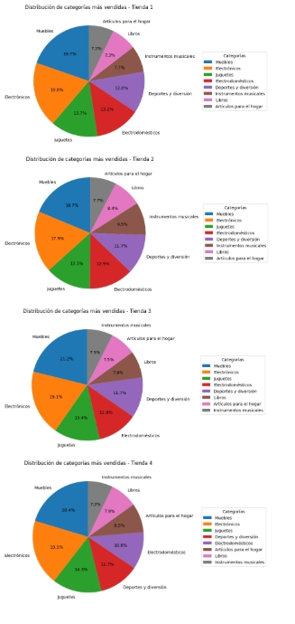

# 📊 Informe Final - Challenge Alura Store Latam

## 1. Objetivo
Analizar el desempeño de las cuatro tiendas de Alura Store Latam y recomendar acciones estratégicas basadas en métricas de negocio. Para nuestro cliente el señor Juan

## 2. Métricas Evaluadas
- **Ingresos totales**  
- **Valoración promedio de clientes**  
- **Costo de envío promedio**   

## 3. Resultados

### Ingresos Totales
| Tienda | Ingresos |
|--------|-----------|
| Tienda 1 | 1,150,880,400 |
| Tienda 2 | 1,116,343,500 |
| Tienda 3 | 1,098,019,600 |
| **Tienda 4** | **1,038,375,700** |

➡️ **La Tienda 4 presenta el menor ingreso total.**

### Valoración Promedio
- Tienda 1: 3.98  
- Tienda 2: 4.04  
- Tienda 3: 4.05  
- Tienda 4: 4.00  

➡️ **La Tienda 1 presenta la menor valoracion promedio.**
### Costo de Envío Promedio
- Tienda 1: 26,018  
- Tienda 2: 25,216  
- Tienda 3: 24,805  
- Tienda 4: 23,459  

➡️ **La Tienda 4 presenta el menor costo de envio promedio. Monto que es con cargo al cliente**

### Categorias con mayor ventas

### Justificación

Una vez habiendo hecho la extracción, trabajo y análisis de los datos sobre la facturación total, popularidad de categorías, evaluación promedio de clientes, productos más y menos vendidos, y costos de envío en las 4 tinedas de Sr. Juan, tenemos la información necesaria para tomar una decisión inteligente basada en datos.

### 📊 Datos clave:

**Tienda 1**: Es la #1 en facturación. Tiene los ingresos más altos ($1,150,880.400 COP), pero obtiene la calificación promedio más baja de todas (3.98⭐), además de ser el costo de envío promedio más alto.

**Tienda 2**: Es la más estable de las 4. Obtiene buenos ingresos y una buena satisfacción al cliente, representa una buena inversión a largo plazo.

**Tienda 3**: Tiene la mejor satisfacción al cliente (4.05⭐), buena diversificación de ventas en sus productos, con un área de mejora amplia en la cantidad de sus ingresos.

**Tienda 4**: Es la que menos facturación obtiene de las 4 ($1,038,375,700 COP), no presenta una satisfacción al cliente tan alta ni y una diversificación de compras entre categorías alta.

### Conclusiones
Después de realizar el análisis de la situación actual de las tiendas, tenemos como resultado un buen negocio entre las 4 tinedas, sin embargo, al estar buscando una expansión en un nuevo emprendimiento y quqerer vender una de las 4 sucursales, tenemos las siguientes recomendaciones:

Se recomeinda que la principal tienda para ser vendida sea la Tienda 4, ya que es la menos rentable en términos generales, y no representa un aporte económico esperado.
Invertir a largo plazo en la Tienda 2 por su estabilidad y rentabilidad.
Identificar los factores de éxito de la Tienda 1 y ver la viabilidad se ser replicados en las demás sucursales.
Promocionar los mejores productos para atraer más público y mejorar los ingresos manteniendo el buen servicio al cliente en la Tienda.
